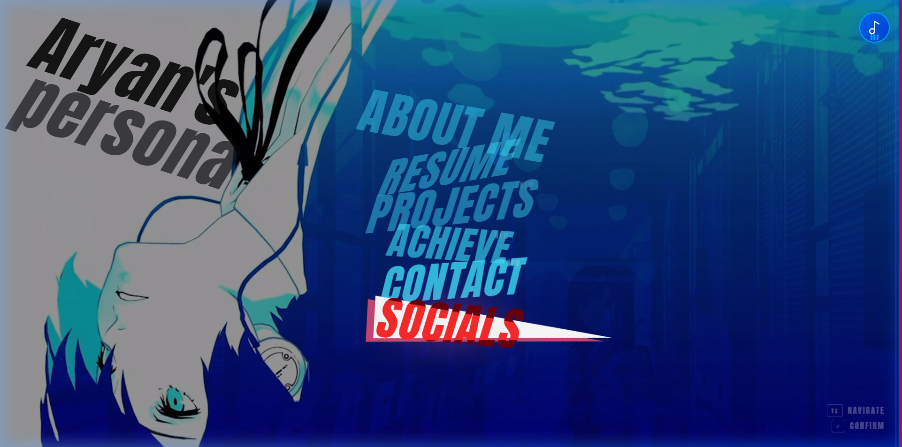
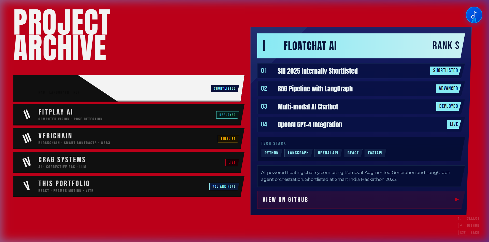
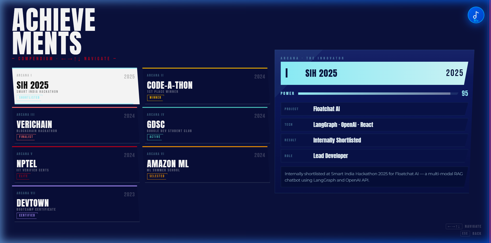
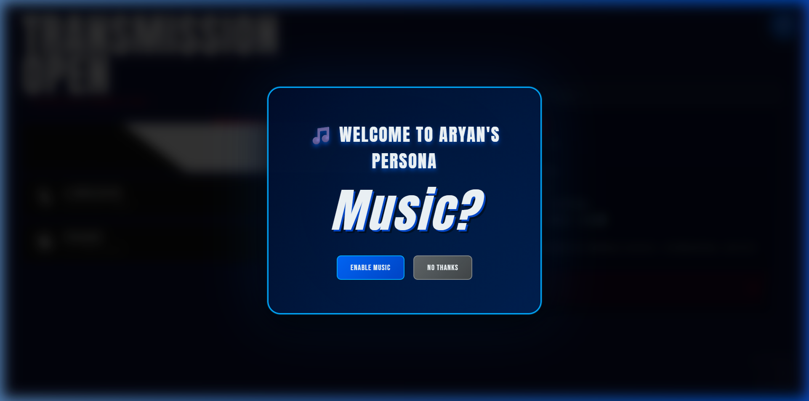

# Persona 3 Inspired Portfolio 🎭

A highly immersive, interactive, and visually striking portfolio inspired by the UI/UX of **Persona 3 Reload**. Built for developers, designers, and creatives who want a portfolio that feels like a premium video game experience.



## 🌟 Features

- **Immersive Video Backgrounds**: High-quality atmospheric looping videos that set the tone.
- **Dynamic CSS Animations**: Clip-paths, scanlines, animated wipes, and hover effects that mimic the game's menu systems.
- **Interactive Terminal UI**: Tech-themed panels with typing effects and cyberpunk aesthetics.
- **Keyboard Navigation**: Fully controllable via `Arrow Keys`, `Enter`, and `ESC`, matching console game UI patterns.
- **Audio Feedback**: Authentic UI sound effects on hover, select, and navigation (if enabled).

## 📸 Gallery

### Projects


### Achievements


### Socials & Contact


## 🚀 Tech Stack

- **Framework**: [React](https://react.dev/) + [Vite](https://vitejs.dev/)
- **Styling**: Vanilla CSS with advanced `clip-path` geometry, keyframe animations, and custom typography (Anton, Bebas Neue, Share Tech Mono).
- **Routing**: `react-router-dom` with Framer Motion for buttery-smooth page transitions.

## 🛠️ Local Development

1. **Clone the repository:**
   ```bash
   git clone https://github.com/aryan-saini-dev/persona-inspired-portfolio.git
   cd persona-inspired-portfolio
   ```

2. **Install dependencies:**
   ```bash
   npm install
   ```

3. **Run the development server:**
   ```bash
   npm run dev
   ```
   Open `http://localhost:5173` in your browser.

## 📄 License

This is a non-commercial tribute project. The Persona UI style and sound effects are inspired by/belong to ATLUS and SEGA. This codebase is free to fork and adapt for your own personal portfolio.
